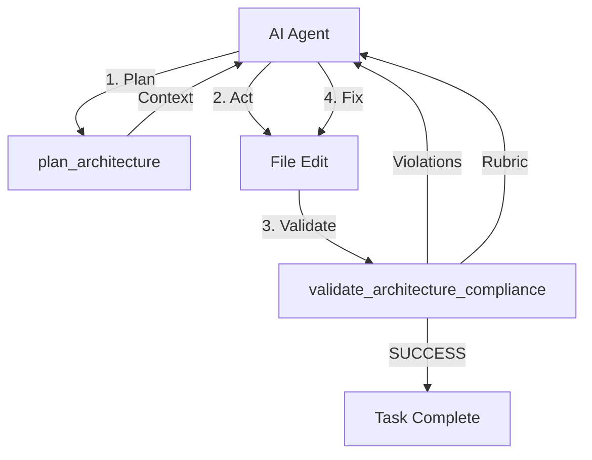

# Aegis V4 Architecture: Universal Agent-Native Microkernel

## The Symbiotic Model

Aegis V4 is a purely **Agent-Native microkernel**. It does not run as a background OS process or a CI gate — it lives inside the AI agent's cognition loop via the **Model Context Protocol (MCP)**.

### Why No OS Hooks

Previous versions relied on git hooks and file watchers. V4 eliminates this friction:

- **Claude/Gemini** receive a **Governance Directive** in their system prompts, making validation a native part of their "thinking" process.
- **Aider** uses a self-healing loop via `--test-cmd`, automatically fixing architectural drift without human intervention.
- **Protocol-First**: The agent, not the developer, is responsible for maintaining the project's structural integrity.

---

## The Tri-Core Architecture

Aegis is composed of three decoupled domains orchestrated by a headless MCP server.

### 1. Policy Domain
- **Universal Harnesses**: Plugin-based system (`ClaudeHarness`, `AiderHarness`, `GeminiHarness`) that injects Aegis into any AI environment.
- **Rule Packs**: 15+ bundled resource packs (Architecture, Security, DDD, etc.) that can be scaffolded JIT.
- **Semantic Engine**: Natural language design intents that the agent must self-evaluate using a re-entrant rubric.

### 2. Evaluation Domain
- **Polyglot AST**: Tree-sitter powered structural analysis for Python, TS/JS, and Rust.
- **Import Graph**: Detects layer violations and circular dependencies across the entire workspace.
- **JIT Graph Cache**: Mtime-based adjacency caching makes validation $O(1)$ during iterative development.
- **Baseline Ledger**: Atomic, thread-safe tracking of technical debt in `.aegis/baseline.json`.

### 3. Coordination Domain (Memory)
- **Cross-Agent Session**: `.aegis/session.json` tracks last validation, active tasks, and handoff notes.
- **Inter-Agent Handoff**: Allows different agents (e.g., Aider for refactoring, Claude for features) to see each other's coordination notes natively.

---

## Agent Interface Layer (High-Level Skills)

To ensure simplicity and intuitive adoption, Aegis exposes a set of **On-Demand Skills** that orchestrate the microkernel's domains.

### 1. The Scorecard (`AEGIS.md`)
A markdown facade that acts as the agent's "front door." It is managed by a `ScorecardService` and reflects the project's living architectural state.

### 2. The Skills
- **Discover**: Enhances `query_knowledge_graph` to provide actionable, natural-language law proposals.
- **Apply**: Automates the lifecycle of `RulePackManager` and `PolicyParser` project-wide.
- **Exception**: Streamlines `BaselineManager` via a "petition" workflow.

---

## Process Flow: The "Plan-Act-Validate" Loop

## The Workspace-Scoped Initializer

`aegis init` is the "bridge" that configures the agent's world for a specific repository:
1. **Local Configuration**: Generates `.claude.json`, `.aider.conf.yml`, `.gemini.json`, and a universal `mcp.json` at the root of your workspace.
2. **Skill Deployment**: Copies markdown-based "Expert Personas" to local `.aegis/skills/`.
3. **Workspace Onboarding**: Generates `.claude.md`, `GEMINI.md`, and `AGENTS.md` automatically during scaffolding.
This ensures Aegis is completely opt-in and does not mutate your global machine state.

## Design Decisions

See `docs/adr/` for detailed architectural logs.
